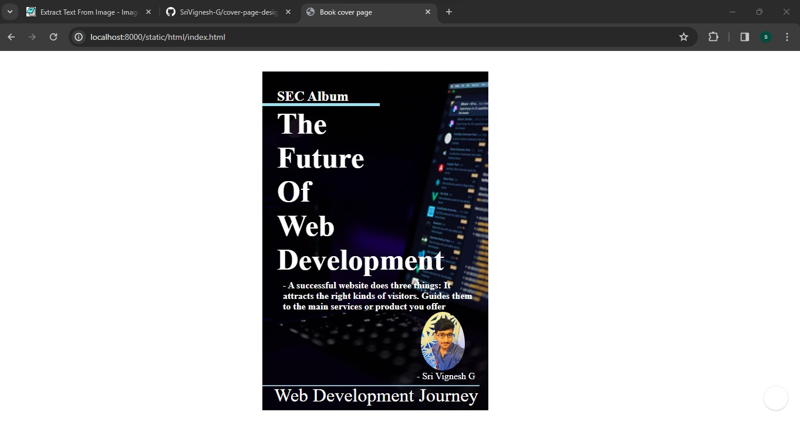

# cover-page-design
## AIM:
To develop a website to display the cover page design of a book

## Design Steps:

### Step 1:
Fork the repository in your github and Clone the repository from the github.

### Step 2:
Make necessary changes in the settings.py.

### Step 3:
Create a folder named static. Add html files in this folder.

### Step 4:
Create your code for book cover page.

### Step 5:
Run the server. Access static and html files.

## Code:
```html
<!DOCTYPE html>
<html lang="en">
<head>
    <meta charset="UTF-8">
    <meta name="viewport" content="width=device-width, initial-scale=1.0">
    <title>Book cover page</title>
</head>
<style>
        *{
            margin-left: 450px;
            margin-top: 35px;
        }
        body{
            margin-top: 145px;
            margin-left: 300px;
            background-repeat: no-repeat;
            box-shadow: 100px;
            background-image: url(background.jpg);
            background-size: 385px;
        }
        .title{
            margin-left: -275px;
            margin-top: -85px;
            font-size: 8vh;
            width:100px;
            font-weight: bolder;
            align-content: center;
        }
        .me{
            max-width: 125px;
            max-height: 100px;
            margin-left: -30px;
            border-radius: 50%;
            margin-top: 60px;
            padding-bottom: 10px;
        }
        .line{
            margin-top: -36px;
            margin-left: -300px;
            color: white;
            border-bottom: 2px;
            width: 370px;
            height: 2px;
            background-color: rgb(141, 189, 207);
        }
        .cmp{
            margin-top: 5px;
            margin-left: -280px;
            padding-top: 5px;
            color: rgb(255, 255, 255);
            font-size: xx-large;
        }
        .name{
            color: rgb(255, 255, 255);
            margin-left: -37px;
            margin-top: -26px;
            padding: 0%;
        }
        .linet{
            height: 5px;
            width: 200px;
            border-top: 3px;
            margin-top: -475px;
            margin-left: -300px;
            background-color: rgb(156, 226, 243);
        }
        .sec{
            color: white;
            font-size: x-large;
            font-weight: bolder;
            margin-left: -275px;
            margin-top: -30px;
        }
        .qts{
            width: 325px;
            padding-top: 10px;
            margin-left: -265px;
            font-weight: bold;
            font-size: medium;
            margin-top: 290px;
            color: white;
        }
</style>
<body>
    <div class="title" style="color: white;">The Future Of Web Development</div>
    
    <div class="cmp">Web Development Journey</div>
    <div class="line"></div>
    <div class="name">- Sri Vignesh G</div>
    <div class="linet"></div>
    <div class="sec">SEC Album</div>
    <div class="qts">- A successful website does three things: It attracts the right kinds of visitors. Guides them to the main services or product you offer</div>
</body>
</html>
```

## Output:



## Result:
The Book cover page has been created successfully.
